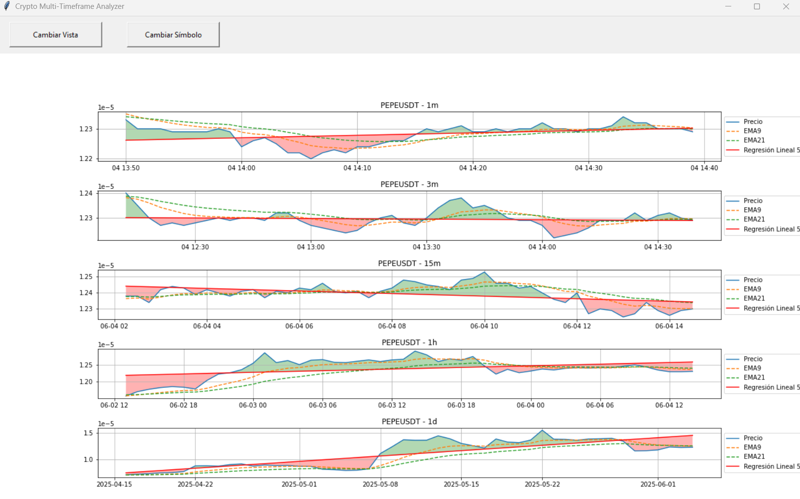

# 🧠 Crypto Multi-Timeframe Analyzer

Una aplicación gráfica en Python para analizar múltiples marcos temporales de criptomonedas utilizando datos en tiempo real desde Binance. Incluye visualización con indicadores técnicos (EMA, regresión lineal), detección de pisos y techos, y alertas sonoras basadas en patrones recientes de velas.

## 📷 Captura de pantalla

 <!-- Agregá una captura en tu repo con ese nombre -->

## 🚀 Funcionalidades

- Visualización simultánea en 5 marcos temporales (`1m`, `3m`, `15m`, `1h`, `1d`)
- Análisis de tendencias mediante regresiones lineales dinámicas
- Detección automática de techos y pisos locales
- Sistema de alertas basado en las últimas 3 velas de 3 minutos (con audio)
- Cambio de símbolo (`BTCUSDT`, `PEPEUSDT`) y tipo de vista (`main`, `analytical`, `floors`)

## 🔧 Requisitos

- Python 3.8 o superior
- Cuenta en [Binance](https://www.binance.com/) con claves API habilitadas

### Dependencias

Instalá las dependencias con:

```bash
pip install -r requirements.txt